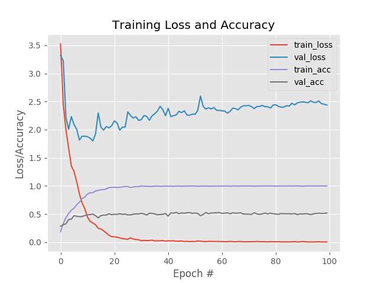

# Flower17Implementation

In this repository, 3 different model is trained with flower17 dataset, and by comparing their relative performance, I try to explain two important concept of machine learning called data augmentation and transfer learning. How this two technique facilitates the classification accuracy is also explained.

### MiniVGGNet

For the first model, I have considered the MiniVGG network. We will provide 64 * 64 * 3 input of this model. Here is the model structure in tabular format. 

| Layer Type | Output Size | Filter Size / Stride |
| --- | --- | --- |
| Input image |  64 × 64 × 3 |    |
| CONV | 32 × 32 × 32 | 3 × 3, K = 32 |
| ACT | 32 × 32 × 32 |  |
| BN | 32 × 32 × 32 |  |
| CONV | 32 × 32 × 32 | 3 × 3, K = 32 |
| ACT | 32 × 32 × 32 |  |
| BN | 32 × 32 × 32 |  |
| POOL | 16 × 16 × 32 | 2 × 2 |
| DROPOUT | 16 × 16 × 32 |  |
| CONV | 16 × 16 × 64 | 3 × 3, K = 64 |
| ACT | 16 × 16 × 64 | |
| BN | 16 × 16 × 64 | |
| CONV | 16 × 16 × 64 | 3 × 3, K = 64 |
| ACT | 16 × 16 × 64 | |
| BN | 16 × 16 × 64 | |
| POOL | 8 × 8 × 64 | 2 × 2 |
| DROPOUT | 8 × 8 × 64 | |
| FC | 512 | |
| ACT | 512 | |
| BN | 512 | |
| DROPOUT | 512 | |
| FC | 17 | |
| SOFTMAX | 17 | |

To run this model:

`python minivggnet.py --dataset <path to dataset>`

However, the flower17 dataset is not included in this repository due to its size. Please **download** the dataset to the root of the directory structure before run the code.

Here is the training loss and accuracy graph for training and test data.

